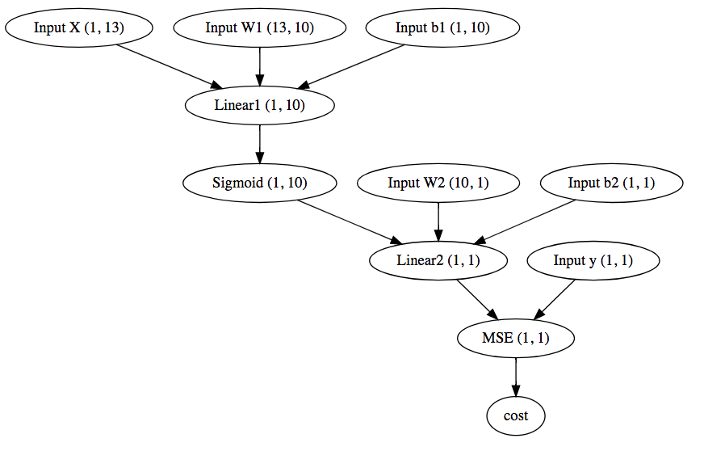
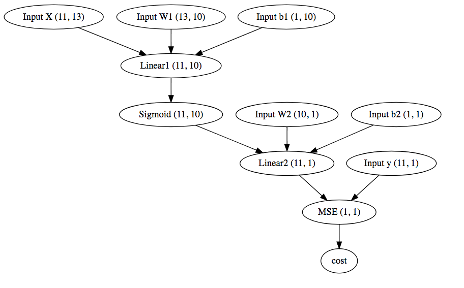
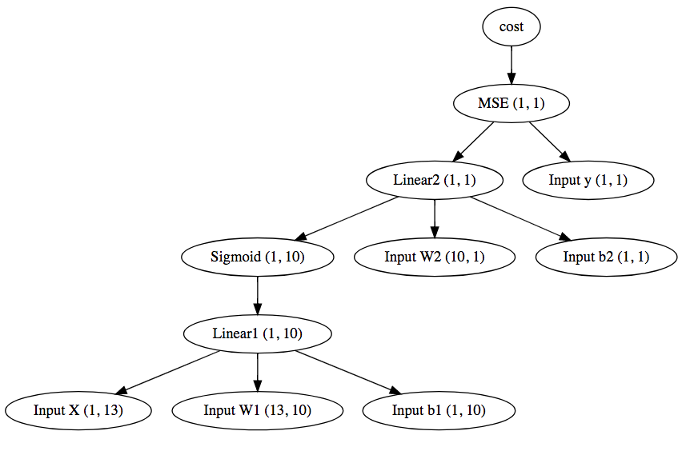

# Java implemention of miniFlow
[](http://www.udacity.com/drive)

This project is created for learning purpose. The original implementation is python based provided by udacity, added here as well under python/ directory for reference.

This implemention doesn't rely on any third party libraries, it also includes "boston house price" [http://scikit-learn.org/stable/modules/generated/sklearn.datasets.load_boston.html] sample data embedded in the java file. No need to install any environment or tools, Just click run in Java IDE.

As java enforce the data type, so it is easier to read through and understand the data type of "values" or "gradients", which I found often confusing in python, as they are sometimes means matrix, and sometimes are vectors or scalars. Please also notice for "gradients" map, the key and value have same shape. 

In this implementation, I use "Value" class to represent any matrix and vector and scalar. Inside, Value is always a 2 dimensional double array, with row and col. For scalar, it is a "1 X 1" matrix, for vector, it is "1 X N" matrix. I found this is better way to represent value and express the operation among them than to have super and sub class. I also use "dot" for matrix tranformation, while "multiple" mean multiple two elements from corresponding location. eg: [1, 2] dot Transpose([1, 2]) = [5], while [1, 2] * [1, 2] = [1, 4].  "A dot B" requires first matrix A number of colunms equals B number of rows. "A * B" requires A and B have same number of rows and columns. Another important tricks I found in this implmentation is to allow processing multiple samples at the same time, by redefining the meaning of matrix "add", eg, you can add bias b to each row of X dot W. For details, please refer Value.java class.


| Files                   | Description                                        |
| ----------------------- | -------------------------------------------------- |
| Graph.java	          | topological sort for neurons                       |
| Input.java	          | input node, eg, X, W, b                            |
| Linear.java	          | linear node to y = X dot W + b                     |    
| MSE.java	              | node to measure distance of two vector             |
| Sigmoid.java	          | node for activation function                       |
| Node.java               | base class of all nodes                            |
| Value.java	          | value represent for matrix, vector or scalar       | 
| test/BostonData.java	  | boston house price data 506 samples and 13 features|                      
| test/Main.java          | construct neural networks and performanc SGD       |

Here is brief flow for what main function does: the goal is to find the "pattern" from 506 boston house price samples, there are 13 features will impact house price. Assuming we already have a neural networks as following:



We want to find out the best of W1_, b1_, W2_ b2_ to minimize the total errors, defined as the cost. Please note, the batch size is 1 and hidden unit is 10, which means 13 features will be reduced to 10 after Linear1, and then will be further reduced to 1 after Linear2. When the batch size is not 1, but 11 for example in our case, the above graph will change a little to 



Please note, as the bias b1 is still "1 X 10", when adding to X dot W, it will be added to each row of X dot W, each row is a sample. 

Here is the code to create neural network
``` java
		int numFeatures = BostonData.FEATURES;
		int numSamples = BostonData.SAMPLES;
		int numHidden = 10;

		Value W1_ = new Value(numFeatures, numHidden).random();
		Value b1_ = new Value(1, numHidden).zero();
		Value W2_ = new Value(numHidden, 1).random();
		Value b2_ = new Value(1, 1).zero();

		// Nodes 
		Input X = new Input("X");
		Input y = new Input("Y");
		Input W1 = new Input(W1_, "W1");
		Input b1 = new Input(b1_, "b1");
		Input W2 = new Input(W2_, "W2");
		Input b2 = new Input(b2_, "b2");
	
		// Structure of the neural network
 		Node Linear1 = new Linear(X, W1, b1, "l1");
		Node Sigmoid = new Sigmoid(Linear1, "s1");
		Node Linear2 = new Linear(Sigmoid, W2, b2, "l2");
		Node cost = new MSE(y, Linear2, "cost");
```
W1, b1, W2, b2 is the Input type of node. We pass optional value and a name for input type of node. Passing a user friendly name is easier for debugging. 

Next we do a topological sorting from all input nodes, please note, constructing the l1, s1, l2, cost will implicitly connect the input node to each layer, which is tracked by each node's "inbounds" and "outbounds" nodes.

``` java

    Node[] inputNodes = new Node[] {X, y, W1, b1, W2, b2};

    List<Node> sortedNodes = Graph.topologicalSort(inputNodes);
    for (Node node: sortedNodes) {
        System.out.println(node.name);
    }
```
Here is the sorting result:

``` java
    Input-X
    Input-Y
    Input-W1
    Input-b1
    Input-W2
    Input-b2
    Linear-l1
    Sigmoid-s1
    Linear-l2
    MSE-cost
```
Then we do forward on each sorted node and propogate the output to the end, where we get the error as cost. 
then back propogate the "error" back to input, and update the "trainables", the backward graph is



``` java
    int epochs = 1000;
    int batchSize = 11;
    int stepsPerEpoch = numSamples / batchSize;
    double learningRate = 0.01;

    for (int i = 0; i < epochs; i++) { 
        double loss = 0.0;
        for (int j = 0; j < stepsPerEpoch; j++) {
            int randomRowIndex = (int)(Math.random() * numSamples);
            X.value = X_.slice(randomRowIndex, batchSize);
            y.value = y_.slice(randomRowIndex, batchSize);
            Graph.forward(sortedNodes);
            Graph.backward(sortedNodes);
            Graph.sgdUpdate(trainables, learningRate);
            loss += sortedNodes.get(sortedNodes.size()-1).value.mean();
        }
        System.out.println("Epoch " + i + ", Loss: " + loss/stepsPerEpoch);
    }
```

Please check the output log at [https://github.com/maxiaodong97/miniFlow/blob/master/java/output.txt]

We get W1, b1, W2, b2 as following

``` java
Node Input-W1 is 
(13, 10)
[5.51 4.82 -4.66 -5.18 -4.29 0.38 -7.88 0.59 12.35 -0.85 ]
[1.11 -1.58 0.93 4.70 -0.40 -0.40 -13.78 12.87 4.66 -4.65 ]
[2.86 10.00 0.76 1.30 -3.19 -4.92 2.81 -6.08 9.36 -2.90 ]
[0.18 -5.04 -2.89 -0.04 11.80 7.19 -0.54 -0.55 2.31 -4.34 ]
[2.55 2.65 -3.84 -1.58 8.03 -9.19 -9.24 -8.07 0.81 -1.61 ]
[8.66 7.04 -3.14 3.62 5.74 13.39 4.33 -7.44 7.19 7.58 ]
[-0.49 -2.10 0.26 -3.59 -4.06 -5.31 5.77 1.78 -5.54 -5.05 ]
[2.98 3.01 -4.50 -12.26 -5.08 -7.50 3.41 -15.29 3.45 2.34 ]
[-14.94 4.83 8.61 6.57 -2.03 5.78 24.68 -10.27 13.44 -10.04 ]
[-10.96 13.01 -5.72 0.99 -10.03 -6.81 -8.68 -4.80 13.06 2.53 ]
[-2.53 -6.37 0.95 -0.31 -4.38 4.19 -2.60 -1.69 -3.06 -2.52 ]
[-0.43 -5.41 4.87 1.27 4.42 -2.11 1.10 4.14 -9.45 0.81 ]
[0.65 9.44 -13.63 -12.33 10.34 0.58 -5.65 -19.30 -6.23 7.49 ]

Node Input-b1 is 
(1, 10)
[-26.02 1.95 -1.22 -18.69 -10.39 -10.99 -13.48 17.51 -4.49 -0.77 ]

Node Input-W2 is 
(10, 1)
[5.84 ]
[6.12 ]
[5.22 ]
[6.27 ]
[6.09 ]
[2.87 ]
[5.66 ]
[12.82 ]
[5.79 ]
[5.18 ]

Node Input-b2 is 
(1, 1)
[-1.54 ]
```

Based on this parameters, we do another forward calculation for some samples: eg: 

``` java
		// Validate the result of first 10 samples
		X.value = X_.slice(0, 10);
		y.value = y_.slice(0, 10);
		Graph.forward(sortedNodes);
		Value a = sortedNodes.get(sortedNodes.size()-2).value; // a is l2 output value
		System.out.println("Calculate result " + a.T().toString());
		System.out.println("Expected result " + y.value.T().toString());
```

The test results are: 

``` java
Calculate result (1, 10)
[23.63 22.32 35.67 32.36 34.93 26.34 18.55 26.88 15.85 18.98 ]

Expected result (1, 10)
[24.00 21.60 34.70 33.40 36.20 28.70 22.90 27.10 16.50 18.90 ]
```
Pretty close, right? :)

I hope this little project helps more people to understand neural network. 
